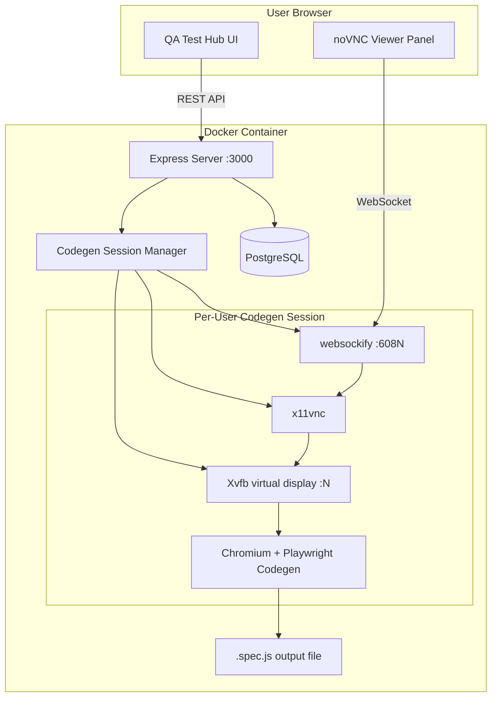
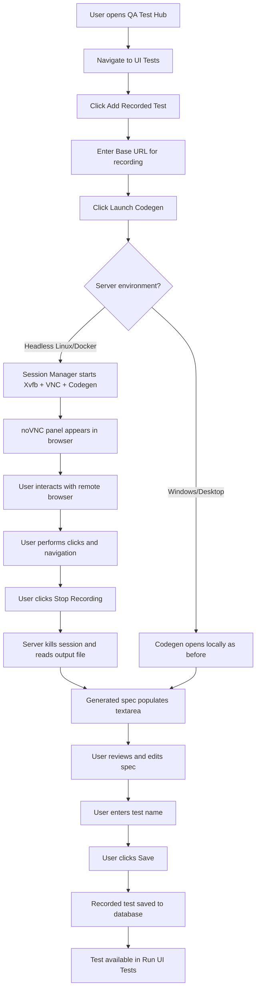

# QA Test Framework

A comprehensive API testing tool with Postman integration that allows you to manage projects, upload API specifications, run tests, and generate HTML reports.

## Features

- **Project Management**: Create and manage multiple projects/workspaces
- **API Specification Upload**: Upload OpenAPI YAML/JSON files or Postman collections
- **Test Execution**: Run selected tests using Newman CLI
- **HTML Reports**: Generate and export comprehensive test reports
- **Multi-Format Support**: Supports OpenAPI YAML, JSON, and Postman Collection formats
- **Signed JWT Auto-generation**: When a Postman collection uses `{{signedjwt-authorize}}` or `{{signedjwt-token}}`, a fresh RS256 JWT is automatically generated and injected before each Newman run — no manual token refresh required
- **UI Tests (Playwright)**: Run browser-based UI tests (page load, key elements visible, basic navigation) against a configurable URL (e.g. 5gapisprint.meoempresas.pt/apis), with separate runs and HTML reports
- **REST API Fuzzing (CATS)**: Run OpenAPI-based fuzz tests via CATS (Contract API Testing Service); view fuzz runs and HTML reports alongside API, UI, and SOAP runs
- **Postman to OpenAPI**: Convert Postman collection JSON to OpenAPI 3.0 (Swagger) YAML for use with CATS, documentation, or other OpenAPI tools
- **Test proxy (URL-based)**: Proxy is inferred from the URL or endpoint used for each run (API, UI, SOAP, Fuzz). Internal URLs (localhost, 127.0.0.1, 10.x.x.x) use no proxy; external URLs use the proxy set in `config/proxies.json` (`activeProxy`). No per-project proxy selection.
- **Test Catalogue / Coverage**: Per-project and global catalogue of all runnable tests (API, SOAP, UI), auto-populated from specs and test definitions, showing last status, last run date, total run count, and per-test notes.
- **Project Archive / Export**: Export a full project as a ZIP archive whose `index.html` opens in the same Tests & Coverage report layout, with per-test historical run context, API request/response proof, and UI video recordings for the latest registered run reflected in coverage.

## Prerequisites and dependencies

The following software is required or optional depending on which features you use. For a full checklist and install instructions, see [SETUP.md](SETUP.md).

| Dependency | Version | Required for |
|------------|---------|--------------|
| **Node.js** | v18 or higher (LTS recommended) | Core app, API, UI, and all test runners |
| **npm** | v8+ (bundled with Node) | Install dependencies and run scripts |
| **PostgreSQL** | v12 or higher | Database (projects, specs, test runs, Playwright runs, fuzz runs, flows, schedules) |
| **Playwright** | Installed via `npm install` | UI tests and recorded tests (built-in and Codegen) |
| **Playwright browsers** | Chromium (required); Firefox & WebKit optional | Run UI tests; install with `npx playwright install chromium` (or `chromium firefox webkit` for all) |
| **Newman** | Installed via `npm install` | Postman collection test execution (API tests) |
| **archiver** | Installed via `npm install` | Project archive/export — generates ZIP bundles of project data and reports |
| **Java** | 17+ | REST API fuzzing (CATS) when using the JAR; not needed if using CATS native binary or Docker |
| **CATS** | JAR or native binary | Optional; required only for **Run Fuzz** (OpenAPI fuzzing). See [SETUP.md – CATS](SETUP.md#6-optional-rest-api-fuzzing-cats) |

**When using Docker:** The Docker image includes Node.js, Playwright Chromium, Xvfb, x11vnc, noVNC/websockify (remote Codegen), Java, and the CATS binary. Database migrations run automatically on app startup. You only need Docker Engine and Docker Compose; see [SETUP.md – Docker](SETUP.md#docker-deployment-recommended-for-saas--production).

## Installation

1. **Ensure prerequisites are installed** (Node.js 18+, PostgreSQL 12+, and optionally Java 17+ and Playwright browsers for full functionality). See [Prerequisites and dependencies](#prerequisites-and-dependencies) and [SETUP.md](SETUP.md).
2. Clone the repository and navigate to the project directory.
3. Install dependencies and run migrations (complete build):

```bash
npm run build
```

Or separately: `npm install` then `npm run migrate`.

4. Create a `.env` file based on `.env.example`:

```bash
cp .env.example .env
```

5. Update the `.env` file with your database credentials and auth settings (use your actual PostgreSQL database name; e.g. `linkuup_db` or `qa_testing`):

```env
DB_HOST=localhost
DB_PORT=5432
DB_NAME=qa_framework
DB_USER=postgres
DB_PASSWORD=your_password

# Required for login/session (change in production)
SESSION_SECRET=your-session-secret-change-in-production
ENABLE_LOCAL_AUTH=true

# Optional: create first admin user (see step 6)
ADMIN_USERNAME=admin
ADMIN_PASSWORD=your_admin_password
```

6. **Create an initial admin user** (required to sign in). Set `ADMIN_USERNAME` and `ADMIN_PASSWORD` in `.env`, **save the file**, then run:

```bash
node scripts/seed-admin.js
```

This creates or updates a local user with admin rights.

7. **Optional – Proxy for test traffic**: If tests must use a corporate proxy, copy `config/proxies.example.json` to `config/proxies.json`, set `activeProxy` to the desired proxy key, and configure `bypass` (e.g. `localhost,127.0.0.1,10.0.0.0/8`) so internal traffic does not go through the proxy. Proxy is applied automatically based on the URL/endpoint of each run (API env URL, UI base URL, SOAP service URL, Fuzz server URL)—there is no per-project proxy setting. See [SETUP.md – Proxy configuration](SETUP.md#4a-optional-proxy-configuration). If the script says "Set ADMIN_USERNAME and ADMIN_PASSWORD in .env", ensure those variables are in `.env` and the file is saved to disk. See [SETUP.md – Auth and admin](SETUP.md#auth-and-initial-admin-user) for details.

## Database Setup

### Initial Database Setup

The application requires PostgreSQL to be installed and running. Follow these steps to set up the database:

1. **Ensure PostgreSQL is running** on your system
2. **Configure database credentials** in your `.env` file (see Installation step 4 above)
3. **Run database migrations** to create the database and all required tables:

```bash
npm run migrate
```

Or manually:

```bash
node scripts/migrate.js
```

This migration script will:

- Connect to PostgreSQL using your `.env` credentials
- Create the database (name from `DB_NAME`) if it doesn't exist
- Run all migration files in order:
  - `000_create_database.sql` - Database creation (handled automatically)
  - `001_create_tables.sql` - Creates all base tables (projects, api_specs, collections, test_runs, test_results, etc.)
  - `002_add_execution_order_and_test_id.sql` - Adds execution order and test ID tracking columns
  - `003_playwright_tables.sql` - Creates playwright_runs and playwright_results for UI tests
  - `004_playwright_recorded_tests.sql` - Creates playwright_recorded_tests for recorded Codegen specs
  - `005_project_scoped_ui_tests.sql` - Adds project_id to playwright_runs and project_recorded_tests junction table
  - `006_flows.sql` - Flows and flow_tasks
  - `007_schedules.sql` - Schedules
  - `008_soap_support.sql` - SOAP operations and run_type on test_runs
  - `009_fuzz_runs.sql` - fuzz_runs and fuzz_results for REST API fuzzing (CATS)
  - `010_fuzz_run_progress.sql` - Fuzz run progress tracking
  - `011_fuzz_run_server_url.sql` - Server URL on fuzz runs
  - `012_playwright_result_screenshot.sql` - Screenshot path on playwright_results
  - `013_playwright_run_artifacts_browser.sql` - Playwright run artifacts and browser
  - `014_playwright_result_video_trace.sql` - Video and trace on playwright results
  - `015_users_and_project_access.sql` - users, project owner/visibility, project_members (auth and project access)
  - `016_users_suspended.sql` - adds `suspended` flag to users (suspended users cannot log in)
  - `017_project_proxy.sql` - adds `proxy_name` to projects (kept for backward compatibility; proxy is now inferred from URL per run)
  - `018_session_store.sql` - creates `session` table for production (express-session with PostgreSQL; avoids in-memory MemoryStore warning)
  - `020_collections_project_id.sql` - makes collections project-specific by adding `project_id` and index to `collections`
  - `021_project_tests_and_stats.sql` - creates `project_tests`, `project_test_stats`, and `project_test_notes` tables for the test catalogue/coverage feature
  - `034_project_test_result_links.sql` - links result rows back to `project_tests` for Archive V2 history/evidence reporting

### Archive V2 Migration and Backfill Notes

Archive V2 uses `project_test_id` links on result tables to show run history per test and attach the detailed evidence that corresponds to the latest registered coverage result.

After pulling Archive V2 changes, run:

```bash
npm run migrate
```

For existing historical results, run the backfill script after migration:

```bash
node scripts/backfill-project-test-result-links.js --project-id <project_id>
```

Omit `--project-id` to backfill all projects. The script links historical `test_results`, recorded `playwright_results`, and confidently matched `fuzz_results` to the project test catalogue without changing aggregate coverage stats.

Archive evidence behavior:

- Each test row keeps the same coverage fields shown in the Tests & Coverage report: last status, last run, total runs, and last run by.
- Each test can show lightweight historical run context once result rows are linked by migration/backfill.
- Detailed evidence files are attached only for the latest registered run/result represented by the coverage row, including result JSON, API request/response text, run report links, UI screenshots, Playwright traces, and UI video recordings when present.
- Raw run-level JSON/report folders remain in the ZIP for audit completeness.

### Migration Files

The `migrations/` directory contains SQL migration files that are executed in alphabetical order:

- **000_create_database.sql** - Database creation instructions (handled by migration script)
- **001_create_tables.sql** - Creates all base tables and indexes
- **002_add_execution_order_and_test_id.sql** - Adds `execution_order` and `test_id` columns to `test_results` table for test ordering and identification
- **003_playwright_tables.sql** - Creates `playwright_runs` and `playwright_results` for UI test runs
- **004_playwright_recorded_tests.sql** - Creates `playwright_recorded_tests` for saved Codegen specs
- **005_project_scoped_ui_tests.sql** - Adds `project_id` to playwright_runs and creates `project_recorded_tests` junction table
- **006_flows.sql** - Flows and flow_tasks
- **007_schedules.sql** - Schedules
- **008_soap_support.sql** - SOAP operations and run_type
- **009_fuzz_runs.sql** - `fuzz_runs` and `fuzz_results` for REST API fuzzing (CATS)
- **010_fuzz_run_progress.sql** - Fuzz run progress
- **011_fuzz_run_server_url.sql** - Server URL on fuzz runs
- **012_playwright_result_screenshot.sql** - Screenshot path on playwright_results
- **013_playwright_run_artifacts_browser.sql** - Playwright run artifacts and browser
- **014_playwright_result_video_trace.sql** - Video and trace on playwright results
- **015_users_and_project_access.sql** - `users`, project `owner_id`/`visibility`, `project_members` (authentication and project access)
- **016_users_suspended.sql** - `suspended` column on `users` (suspended users cannot log in; used by Manage users)
- **017_project_proxy.sql** - `proxy_name` column on `projects` (kept for compatibility; proxy is inferred from URL/endpoint per run, not from project)
- **018_session_store.sql** - `session` table for production session storage (connect-pg-simple; used when `NODE_ENV=production` to avoid MemoryStore warning)
- **020_collections_project_id.sql** - `project_id` column and index on `collections` so standalone Postman collections can belong to a single project
- **021_project_tests_and_stats.sql** - `project_tests` (per-project master test catalogue), `project_test_stats` (aggregated per-test execution stats), `project_test_notes` (per-test notes)
- **034_project_test_result_links.sql** - nullable `project_test_id` links and indexes on `test_results`, `playwright_results`, and `fuzz_results` for Archive V2 evidence mapping

### Manual Database Setup (Alternative)

If you prefer to set up the database manually:

1. **Create the database**:

```sql
CREATE DATABASE qa_framework;
```

1. **Connect to the database**:

```bash
psql -U postgres -d qa_framework
```

1. **Run migration files** in order:

```sql
\i migrations/001_create_tables.sql
\i migrations/002_add_execution_order_and_test_id.sql
\i migrations/003_playwright_tables.sql
\i migrations/004_playwright_recorded_tests.sql
\i migrations/005_project_scoped_ui_tests.sql
```

### Database Schema

The application uses the following main tables:

- **projects** - Project/workspace information
- **api_specs** - API specification files (OpenAPI YAML/JSON)
- **collections** - Postman collections
- **project_api_specs** - Many-to-many relationship between projects and API specs
- **test_runs** - Test execution metadata (name, status, counts, duration)
- **test_results** - Individual test results with:
  - Test execution details (name, endpoint, method, status)
  - Request/response bodies
  - Assertions and error messages
  - `execution_order` - Preserves the order tests were executed
  - `test_id` - Unique identifier for each test (e.g., TEST-1, TEST-2)

### Troubleshooting Database Issues

**Error: "column execution_order does not exist"**

- Solution: Run the migration script to add the new columns:
  ```bash
  npm run migrate
  ```

**Error: "client password must be a string"**

- Solution: Ensure `DB_PASSWORD` in your `.env` file is set and not empty

**Error: "Connection refused"**

- Solution: Verify PostgreSQL is running and check `DB_HOST`, `DB_PORT`, and `DB_USER` in your `.env` file

**Error: "database does not exist"**

- Solution: The migration script should create it automatically. If not, create it manually:
  ```sql
  CREATE DATABASE qa_framework;
  ```

**Login returns 500 or "column suspended does not exist"**

- Solution: Run all migrations so the `users` table has the `suspended` column:
  ```bash
  npm run migrate
  ```
  Then restart the server.

**"MemoryStore is not designed for a production environment" (Docker/server)**

- Solution: Run with `NODE_ENV=production` (Docker Compose sets this by default) and run migrations so the `session` table exists (migration `018_session_store.sql`). The app then uses PostgreSQL for sessions instead of in-memory storage. If the warning persists, run `docker compose exec app npm run migrate` and restart the app.

**Newman run crashes with "Unknown object type asyncfunction"**

- Solution: The project overrides `object-hash` to v2.x (in `package.json` overrides) so collections that use async code in scripts do not crash. Ensure you run `npm install` (or rebuild the Docker image) so the override is applied.

**Archive report shows "No linked run history yet"**

- Solution: Run the Archive V2 migration and historical backfill:
  ```bash
  npm run migrate
  node scripts/backfill-project-test-result-links.js --project-id <project_id>
  ```
- Notes: New API/SOAP and recorded UI runs populate `project_test_id` automatically after this update. Older runs need the backfill script. Fuzz results are linked only when endpoint/method matching is unambiguous.

## Dependency checklist (local run)

Before running the app locally, ensure:

- [ ] **Node.js** 18+ and **npm** installed (`node -v`, `npm -v`)
- [ ] **PostgreSQL** 12+ installed and running; database created or migration will create it
- [ ] **`.env`** created from `.env.example` with correct `DB_*` values and **`SESSION_SECRET`** (required for login)
- [ ] **`npm install`** and **`npm run migrate`** completed
- [ ] **Initial admin user** created: set `ADMIN_USERNAME` and `ADMIN_PASSWORD` in `.env`, save the file, then run `node scripts/seed-admin.js` (see [SETUP.md – Auth and admin](SETUP.md#auth-and-initial-admin-user))
- [ ] (Optional) **Playwright browsers** for UI tests: `npx playwright install chromium`
- [ ] (Optional) **Java 17+** and **CATS** (JAR or binary) if you use **Run Fuzz** — see [SETUP.md](SETUP.md#6-optional-rest-api-fuzzing-cats)
- [ ] (Optional) **`config/proxies.json`** created from `config/proxies.example.json` with `activeProxy` set if tests must use a corporate proxy; proxy is inferred from the URL/endpoint of each run — see [SETUP.md – Proxy configuration](SETUP.md#4a-optional-proxy-configuration)

## Running the Application

Start the server:

```bash
npm start
```

For development with auto-reload:

```bash
npm run dev
```

The application will be available at `http://localhost:3000` (or the port set in `PORT`). You must sign in with a user account; use the admin user created by `node scripts/seed-admin.js` (Local account) or an Active Directory account if AD auth is enabled.

## Usage

1. **Create a Project**: Navigate to Projects and create a new project/workspace
2. **Upload API Specifications**:
  - Go to API Specs
  - Upload YAML or JSON OpenAPI specification files
  - The system will automatically convert them to Postman collections
3. **Add API Specs to Project**:
  - Open your project
  - Click "Add API Spec" to add API specifications from the library
4. **Run Tests**:
  - In your project, click "Run Tests"
  - Select which tests to run
  - Provide a test run name (e.g., "Release 1.0")
  - Optionally configure delays:
    - **Global Delay**: set "Delay between tests (seconds)" — the runner will wait this many seconds before starting the next test.
    - **Per-test Delay**: each test row includes a "Delay s" input to specify seconds to wait *after* that specific test; per-test delays override the global delay for that transition.
    - Delays accept numbers (seconds); fractional values (e.g., 0.5) are supported. A value of 0 disables delay.
  - Click "Run Tests"

**Delay behavior notes:**

- When delays are present the runner executes tests **sequentially** (each test runs as its own Newman invocation), and waits the configured seconds before the next test. The total test run duration includes delays.
- Use per-test delays when you need custom wait times between specific consecutive tests; otherwise use the global delay for a consistent pause between tests.

### JWKS / Signed JWT for API runs

Some CAMARA / OAuth 2.0 APIs require a signed client assertion JWT (a `{{signedjwt}}`) for the `bc-authorize` and `token` endpoints. The framework generates these automatically before each Newman run when the collection references them.

#### Step 1 — Generate the RSA key pair and JWKS (one-time per project)

1. Open your project and click **Generate JWKS / JWT** (in the project actions area).
2. Enter **Client ID** (used as `iss` and `sub` claims) and **Endpoint / Audience** (e.g. `https://example.com/v1/bc-authorize`).
3. Click **Generate**. The tool runs the `jwks/generate_jwt_and_jwks.sh` script and displays:
   - **JWKS** (`jwks.json`) — register this JSON with the authorization server so it can verify your JWT signatures.
   - **JWT Token** (`token.jwt`) — a preview JWT for manual testing; it expires after 5 minutes.
4. Copy the JWKS and register it with the authorization server. The RSA private key is stored at `keys/project-{id}/private.pem` and reused for all subsequent automated runs.

> **Note:** The `token.jwt` file is only a preview. Automated test runs always generate a fresh JWT (new `iat`, `exp`, `jti`) from the stored private key — it is never expired.

#### Step 2 — Add environment variables (Manage Environments)

In **Manage Environments**, add the following variables to the environment used for your run:

| Variable | Required | Description |
|---|---|---|
| `jwt_issuer` | ✅ Always | Client ID — used as `iss` and `sub` claims in the JWT |
| `jwt_audience_signedjwt-authorize` | ✅ When collection uses `{{signedjwt-authorize}}` | Audience for the `bc-authorize` endpoint (e.g. `https://example.com/v1/bc-authorize`) |
| `jwt_audience_signedjwt-token` | ✅ When collection uses `{{signedjwt-token}}` | Audience for the `token` endpoint (e.g. `https://example.com/v1/token`) |
| `jwt_ttl` | Optional | JWT validity in seconds (default: `300`, max: `300`) |
| `jwt_kid` | Optional | Key ID override; auto-derived from the public key SHA-256 if absent or empty |
| `jwt_private_key` | Optional | RSA private key PEM content; if set, takes priority over the project key file at `keys/project-{id}/private.pem` |

#### Step 3 — Run the collection

Click **Run API Tests** as normal. Before Newman starts, the runner:

1. Scans the merged collection for `{{signedjwt-authorize}}` and `{{signedjwt-token}}`.
2. For each variable found, reads the corresponding `jwt_audience_*` env var and generates a fresh RS256 JWT signed with the project's private key.
3. Injects the generated tokens as Newman environment variables (`signedjwt-authorize`, `signedjwt-token`).

If a collection uses `{{signedjwt-authorize}}` but the `jwt_audience_signedjwt-authorize` env var is missing, the run fails immediately with a descriptive error message naming the missing variable.

#### JWT claims

Each generated JWT contains:

```json
{
  "alg": "RS256",
  "typ": "JWT",
  "kid": "kid-<sha256-of-public-key>"
}
.
{
  "iss": "<jwt_issuer>",
  "sub": "<jwt_issuer>",
  "aud": "<jwt_audience_signedjwt-*>",
  "iat": <now>,
  "exp": <now + jwt_ttl>,
  "jti": "<random-16-byte-hex>"
}
```

1. **View Reports**:
  - Go to Test Runs to see all test executions
  - Click on a test run to view details
  - Click "View Report" to see the HTML report in a new window
  - Click "Download Report" to download the report as an HTML file

### REST API Fuzzing (Fuzz runs)

Fuzz runs use [CATS](https://github.com/Endava/cats) (Contract API Testing Service) to test your OpenAPI endpoints with generated and boundary inputs. From a project, click **Run Fuzz**, select an **API Spec** (OpenAPI YAML/JSON only), enter the **Base URL** (server URL for CATS), and a **Run name**. Fuzz runs appear in **Test Runs** with the **Fuzz** badge; open a run for details and use **View Report** / **Download Report** for the HTML report.

**Installing CATS:** You need Java 17+ and the CATS JAR (or native binary on macOS/Linux). See [SETUP.md – Installing CATS](SETUP.md#6-optional-rest-api-fuzzing-cats) for step-by-step instructions (download JAR, set `CATS_CMD` in `.env`, verify). Without CATS installed, "Run Fuzz" will create a run that immediately fails with no results.

**Verification scripts:**

- `scripts/run-sample-execution-with-delay.js` — creates a small two-request collection and runs it with a configured `delayBetweenTests` to validate delay timing.
- `scripts/create-test-run-fixture.js` — creates a synthetic test run (success + failure) and generates an HTML report for manual verification of report content (response bodies, errors).
- `scripts/backfillProjectTests.js` — one-off/periodic script that syncs the test catalogue for all projects and backfills `project_test_stats` from historical API, SOAP, and UI runs so coverage views start with realistic counts and last-status values.

### Converting Postman collections to OpenAPI (Swagger) YAML

You can convert a Postman collection (JSON) to OpenAPI 3.0 YAML for use with CATS fuzzing, Swagger UI, or other OpenAPI-based tools.

**Web UI:** In the app header go to **Settings → Postman to OpenAPI**. Upload a Postman collection (JSON) and click **Convert and download OpenAPI YAML** to get the OpenAPI file. You can also use the CLI below.

**What the converter does:**

- Walks all requests in the collection (including nested folders)
- Builds OpenAPI paths, operations, and parameters from method, URL, headers, query, and body
- Uses collection `info` and variables (e.g. `base_url`) for `info` and `servers`
- Adds Bearer auth in `components.securitySchemes` when used in request headers
- Writes standard OpenAPI 3.0 YAML

**Usage:**

```bash
# Output path optional; if omitted, writes <collection-name>.openapi.yaml next to the JSON
node scripts/postman-to-swagger.js <postman-collection.json> [output.yaml]
```

Or via npm:

```bash
npm run postman-to-swagger -- "path/to/collection.postman_collection.json" "output.openapi.yaml"
```

**Example** (convert the CAMARA Tests collection):

```bash
npm run postman-to-swagger -- "SmartAPI-CAMARA R2.0.0 - Tests.postman_collection.json" "SmartAPI-CAMARA-R2.0.0-Tests.openapi.yaml"
```

The script supports Postman collection v2.0 and v2.1. The generated YAML can be uploaded as an API spec in the app or used with CATS, Swagger Editor, or any OpenAPI 3.0 tool.

### Playwright / UI Tests

UI tests run in a separate **UI Tests** section (nav: "UI Tests"). They target a configurable base URL and execute: page load, key elements visible, and basic navigation.

**Setup:**

1. Install dependencies (Playwright and Newman are included): `npm install`
2. Install Playwright browser(s) (required once per machine or CI):
   - Minimum: `npx playwright install chromium`
   - All browsers (Chromium, Firefox, WebKit): `npx playwright install chromium firefox webkit`
3. Optional: in `.env` set:
  - `PLAYWRIGHT_BASE_URL` – default URL to test (e.g. `https://5gapisprint.meoempresas.pt/apis`)
  - `PLAYWRIGHT_TIMEOUT_MS` – timeout in ms (default: 30000)
  - `PLAYWRIGHT_HEADLESS` – `true` or `false` (default: true)

**From the app:** Open **UI Tests**, click **Run UI Tests**, enter a run name and optionally override the base URL, then Run. View list, open a run for details, and use **View Report** / **Download Report** for the HTML report.

**From the CLI:**  
`npm run test:playwright`  
This runs the same suite using the default base URL from config and stores results in the database.

**Run a full spec from Cursor / Playwright Agents / terminal:**  
Use the root `playwright.config.js` (points at `e2e/`) so you can run specs directly with the Playwright Test runner:

```bash
# Run all e2e specs
npx playwright test

# Run one spec file
npx playwright test e2e/recorded/recorded-1770467547370.spec.js

# Run headed (see browser)
npx playwright test --headed

# Run with UI (debug)
npx playwright test --ui
```

Respects `.env`: `PLAYWRIGHT_BASE_URL`, `PLAYWRIGHT_TIMEOUT_MS`, `PLAYWRIGHT_HEADLESS`.

**Recorded UI tests:** You can define extra test cases by recording browser interactions with Playwright Codegen and saving them in the app.

1. In the app go to **UI Tests** → **Add recorded test** (or **Manage recorded tests**).
2. In a terminal run: `npx playwright codegen <your-url>` (use the same base URL you test against). Perform the actions you want to test; the Playwright Inspector will show generated test code.
3. Copy the generated code from the Inspector and paste it into the **Generated spec** field. Enter a **Test name** and optionally a **Base URL**, then click **Save**.
4. Recorded tests appear in the test list when you click **Run UI Tests** (they are listed as "Recorded: &lt;name&gt;"). You can run them alone or together with the built-in tests.
5. Use **Manage recorded tests** to edit or delete saved recordings.

**Note:** On headless Linux/Docker servers, "Launch Codegen" uses **remote recording via noVNC** — the browser runs on the server and is streamed to your browser. No local software installation is needed. See [Remote Codegen (Recording UI Tests in the Browser)](#remote-codegen-recording-ui-tests-in-the-browser) below. On Windows/desktop, Codegen opens locally as before. You can also always use the paste-and-save flow above.

### Remote Codegen (Recording UI Tests in the Browser)

When deployed on a **headless Linux server or Docker container**, the app provides a fully browser-based test recording experience using **Xvfb** (virtual display), **x11vnc**, and **noVNC**. Users can record Playwright tests without installing any software on their laptops.

#### How it works

1. **Launch Codegen** — user clicks the button and enters a target URL
2. **Remote session starts** — the server creates a virtual display, launches Chromium with Playwright Codegen, and streams the browser to the user via noVNC
3. **Interact** — user sees and controls the remote browser in an embedded panel within the app, clicking through the site to record actions
4. **Stop Recording** — user clicks "Stop Recording"; the server kills the session and returns the generated Playwright spec
5. **Save** — the generated code populates the spec textarea; user reviews, names the test, and saves it

#### Architecture



#### User flow



#### Quick start with Docker

```bash
cp .env.example .env
# Edit .env — set DB_PASSWORD, SESSION_SECRET (required for production); for first-time login also set ADMIN_USERNAME and ADMIN_PASSWORD
docker compose up --build -d
# Migrations run automatically on app startup (including 018_session_store for production session storage).
# With NODE_ENV=production (default in docker-compose), sessions are stored in PostgreSQL; set a strong SESSION_SECRET.
# If ADMIN_USERNAME and ADMIN_PASSWORD are set in .env, the admin user is created on first startup.
# Otherwise run: docker compose exec app node scripts/seed-admin.js (after adding ADMIN_USERNAME and ADMIN_PASSWORD to .env and restarting, or pass env when exec’ing)
# If you see DB schema errors (e.g. missing column), run: docker compose exec app npm run migrate
# Open http://<server-ip>:3000
```

#### Remote Codegen environment variables


| Variable                     | Default  | Description                                            |
| ---------------------------- | -------- | ------------------------------------------------------ |
| `CODEGEN_MAX_SESSIONS`       | `3`      | Maximum concurrent remote Codegen sessions             |
| `CODEGEN_SESSION_TIMEOUT_MS` | `600000` | Session auto-timeout in milliseconds (default: 10 min) |
| `CODEGEN_VNC_PORT_START`     | `6080`   | First websockify port; sessions use 6080, 6081, ...    |


#### Limitations and notes

- Each remote session uses one Xvfb display + one Chromium instance, so server resources limit concurrency. Adjust `CODEGEN_MAX_SESSIONS` based on your VM's RAM and CPU.
- Sessions auto-terminate after the timeout. The frontend shows a countdown timer.
- On **Windows or desktop Linux with a display**, "Launch Codegen" uses the existing local behavior (opens a Codegen window on the server). The remote noVNC path only activates on headless Linux.
- **Paste-and-save still works:** users with local Playwright installed can still run `npx playwright codegen <url>` on their machine and paste the generated code.

## Project Structure

```
.
├── config/          # Database and Playwright configuration (database.js, playwright.js)
├── e2e/             # Playwright E2E tests (recorded specs in e2e/recorded/, config in ui-tests.config.js)
├── migrations/      # Database migration scripts
├── models/          # Sequelize models
├── public/          # Frontend files (HTML, CSS, JS)
├── routes/          # Express routes
├── scripts/         # Utility scripts
├── services/        # Business logic services (including codegenSessionManager.js)
├── server.js        # Application entry point
├── Dockerfile       # Production Docker image
├── docker-compose.yml # Docker Compose (app + PostgreSQL)
└── package.json     # Dependencies and scripts
```

## API Endpoints

### Projects

- `GET /api/projects` - List all projects
- `POST /api/projects` - Create a project
- `GET /api/projects/:id` - Get project details
- `PUT /api/projects/:id` - Update project
- `DELETE /api/projects/:id` - Delete project

### API Specifications

- `GET /api/api-specs` - List all API specs
- `POST /api/api-specs/upload` - Upload API spec file
- `GET /api/api-specs/:id` - Get API spec details
- `DELETE /api/api-specs/:id` - Delete API spec

### Collections

- `GET /api/collections` - List all collections
- `GET /api/projects/:projectId/collections` - Get collections for a project
- `POST /api/collections/upload` - Upload Postman collection

### Test Runs

- `GET /api/test-runs` - List test runs
- `POST /api/test-runs/execute` - Execute tests (supports optional `delayBetweenTests` in seconds and `testDelays` mapping for per-test delays in seconds)
- `GET /api/test-runs/:id` - Get test run details
- `POST /api/test-runs/:id/report` - Generate HTML report
- `GET /api/test-runs/:id/report/download` - Download report

### Fuzz Runs (REST API Fuzzing with CATS)

- `POST /api/fuzz-runs/execute` - Start a fuzz run (body: `projectId`, `apiSpecId`, `name`, `serverUrl`; optional: `flowId`, `paths`, `skipPaths`)
- `GET /api/fuzz-runs` - List fuzz runs (query: `projectId`, `limit`, `offset`)
- `GET /api/fuzz-runs/:id` - Get fuzz run with results
- `GET /api/fuzz-runs/:id/report` - HTML report
- `GET /api/fuzz-runs/:id/report/download` - Download report
- `DELETE /api/fuzz-runs/:id` - Delete fuzz run

### Playwright / UI Tests

- `GET /api/playwright-config` - Get default base URL for UI
- `GET /api/playwright-tests/list` - List all tests (built-in + recorded)
- `POST /api/playwright-runs/execute` - Start a UI test run (body: `name`, optional `baseUrl`, `suite`, optional `selectedTestIds` for "selected" suite)
- `GET /api/playwright-runs` - List UI test runs
- `GET /api/playwright-runs/:id` - Get run with results
- `GET /api/playwright-runs/:id/report` - HTML report
- `GET /api/playwright-runs/:id/report/download` - Download report
- `DELETE /api/playwright-runs/:id` - Delete run

### Playwright recorded tests (Codegen paste-and-save)

- `GET /api/playwright-recorded-tests` - List recorded tests
- `POST /api/playwright-recorded-tests` - Create (body: `name`, `spec_content`, optional `base_url`)
- `GET /api/playwright-recorded-tests/:id` - Get one recorded test
- `PUT /api/playwright-recorded-tests/:id` - Update (body: optional `name`, `spec_content`, `base_url`)
- `DELETE /api/playwright-recorded-tests/:id` - Delete
- `POST /api/playwright-recorded-tests/launch-codegen` - Launch Playwright Codegen (optional; requires display; body: optional `baseUrl`)

### Test Catalogue / Coverage

- `GET /api/projects/:projectId/tests/catalogue` - Get the per-project test catalogue for a project, including aggregated stats for each test.
- `POST /api/projects/:projectId/tests/catalogue/sync` - Re-scan API specs, Postman/OpenAPI collections, WSDL SOAP operations, and UI tests (built-in + recorded) to refresh the project’s test catalogue baseline.
- `PATCH /api/projects/:projectId/tests/:projectTestId` - Update a single catalogue entry (name, description, active flag).
- `GET /api/projects/:projectId/tests/:projectTestId/notes` - List notes for a single catalogue test (most recent first).
- `POST /api/projects/:projectId/tests/:projectTestId/notes` - Add a new note to a test (body: `note`).
- `GET /api/tests/catalogue` - Global catalogue across all projects, with filters by `projectId`, `test_type`, and `last_status`; used by the Test Catalogue UI for coverage metrics.

## Database Schema

The application uses PostgreSQL with the following main tables:

- **projects** - Project/workspace information
  - `id`, `name`, `description`, `created_at`, `updated_at`
- **api_specs** - API specification files (OpenAPI YAML/JSON)
  - `id`, `name`, `description`, `format`, `file_path`, `spec_content`, etc.
- **collections** - Postman collections
  - `id`, `name`, `version`, `collection_json`, `api_spec_id`
- **project_api_specs** - Many-to-many relationship between projects and API specs
  - `id`, `project_id`, `api_spec_id`, `added_at`
- **test_runs** - Test execution metadata
  - `id`, `name`, `status`, `project_id`, `total_tests`, `passed_tests`, `failed_tests`, `duration_ms`, `created_at`
- **test_results** - Individual test results
  - `id`, `test_run_id`, `test_name`, `endpoint`, `method`, `status`
  - `duration_ms`, `request_body`, `response_body`, `response_code`
  - `assertions` (JSONB), `error_message`, `api_spec_id`
  - `execution_order` - Preserves the order tests were executed (added in migration 002)
  - `test_id` - Unique identifier for each test, e.g., TEST-1, TEST-2 (added in migration 002)
  - `created_at`
- **playwright_runs** - UI test run metadata (migration 003; migration 005 adds `project_id`)
  - `id`, `name`, `status`, `base_url`, `total_tests`, `passed_tests`, `failed_tests`, `duration_ms`, `project_id`, `created_at`
- **playwright_results** - Individual UI test results (migration 003)
  - `id`, `playwright_run_id`, `test_name`, `status`, `duration_ms`, `error_message`, `created_at`
- **playwright_recorded_tests** - Saved Codegen specs (migration 004)
  - `id`, `name`, `spec_content`, `base_url`, `created_at`, `updated_at`
- **project_recorded_tests** - Many-to-many: projects ↔ recorded UI tests (migration 005)
  - `id`, `project_id`, `recorded_test_id`, `added_at`
- **fuzz_runs** - Fuzz run metadata (migration 009)
  - `id`, `name`, `status`, `project_id`, `api_spec_id`, `flow_id`, `total_tests`, `passed_tests`, `failed_tests`, `duration_ms`, `report_path`, `created_at`
- **fuzz_results** - Individual fuzz test results (migration 009)
  - `id`, `fuzz_run_id`, `test_name`, `endpoint`, `method`, `status`, `duration_ms`, `request_body`, `response_body`, `response_code`, `fuzzer_name`, `error_message`, `execution_order`, `created_at`
- **project_tests** - Per-project master test catalogue (migration 021)
  - `id`, `project_id`, `test_type` (`api`, `soap`, `ui_builtin`, `ui_recorded`), `source_id`, `source_kind`, `stable_key`, `name`, `description`, `endpoint`, `method`, `is_active`, `created_at`, `updated_at`
- **project_test_stats** - Aggregated execution stats per catalogue entry (migration 021)
  - `id`, `project_test_id`, `total_runs`, `last_status`, `last_run_at`, `last_run_source`, `last_run_type`, `last_run_id`, `created_at`, `updated_at`
- **project_test_notes** - Free-form notes/comments per catalogue test (migration 021)
  - `id`, `project_test_id`, `author_id`, `note`, `created_at`

## Environment Variables

- `DB_HOST` - PostgreSQL host (default: localhost)
- `DB_PORT` - PostgreSQL port (default: 5432)
- `DB_NAME` - Database name (default: qa_framework)
- `DB_USER` - Database user (default: postgres)
- `DB_PASSWORD` - Database password
- `PORT` - Server port (default: 3000)
- **`SESSION_SECRET`** - Secret for session cookies (required for auth; use a strong value in production)
- **`NODE_ENV`** - Set to `production` on the server (Docker Compose sets this by default). When `production`, sessions are stored in PostgreSQL (migration `018_session_store.sql`) instead of in-memory, avoiding the MemoryStore warning and session loss on restart.
- **`COOKIE_SECURE`** - Set to `true` only when the app is served over HTTPS. Leave unset (or false) for Docker or `http://localhost`, otherwise the session cookie is not sent and login appears to fail (401 on `/api/auth/me`).
- **`ENABLE_LOCAL_AUTH`** - Enable local username/password login (default: true)
- **`ENABLE_AD_AUTH`** - Enable Active Directory login (default: false). When true, set `AD_URL`, `AD_BASE_DN`, and optionally `AD_BIND_DN`, `AD_BIND_PASSWORD`, `AD_DOMAIN`
- **`ENABLE_PAM_AUTH`** - Enable PAM (OS user) login (default: false). **Linux only.** When true, set **`PAM_AUTH_URL`** to the URL of the PAM auth proxy. When the app runs in Docker, the proxy must run on the host; use `http://host.docker.internal:9090` on Windows/Mac (Docker Desktop), or on Linux use the host IP (e.g. `http://10.0.0.5:9090`) or add `extra_hosts: - "host.docker.internal:host-gateway"` to the app service and use `http://host.docker.internal:9090`. See [SETUP.md – PAM (OS user) login](SETUP.md#pam-os-user-login) for details.
- **`ADMIN_USERNAME`** / **`ADMIN_PASSWORD`** - Used by `node scripts/seed-admin.js` to create or update the first admin user (local auth). Must be set in `.env` and the file saved before running the script.
- `UPLOAD_DIR` - Directory for uploaded files (default: ./uploads)
- `REPORTS_DIR` - Directory for generated reports (default: ./reports)
- `MAX_FILE_SIZE` - Maximum upload file size in bytes (default: 10485760)
- `PLAYWRIGHT_BASE_URL` - Default URL for UI tests (e.g. [https://5gapisprint.meoempresas.pt/apis](https://5gapisprint.meoempresas.pt/apis))
- `PLAYWRIGHT_TIMEOUT_MS` - Timeout for Playwright actions in ms (default: 30000)
- `PLAYWRIGHT_HEADLESS` - Run browser headless: true or false (default: true)
- `CATS_CMD` - Optional; CATS CLI command (e.g. `cats` or `java -jar /path/to/cats.jar`) when not on PATH

**Signed JWT / JWKS (API test runs)** — set these as environment variables in **Manage Environments**, not in `.env`:
- `jwt_issuer` — client ID used as `iss`/`sub` in the generated JWT (required when collection uses `{{signedjwt-authorize}}` or `{{signedjwt-token}}`)
- `jwt_audience_signedjwt-authorize` — audience (`aud`) for the `bc-authorize` JWT; required when collection uses `{{signedjwt-authorize}}`
- `jwt_audience_signedjwt-token` — audience (`aud`) for the `token` JWT; required when collection uses `{{signedjwt-token}}`
- `jwt_ttl` — JWT validity in seconds (optional; default `300`, max `300`)
- `jwt_kid` — key ID override (optional; auto-derived from public key SHA-256 if absent)
- `jwt_private_key` — RSA private key PEM content (optional; falls back to `keys/project-{id}/private.pem` generated by the JWKS modal)
- `CODEGEN_MAX_SESSIONS` - Maximum concurrent remote Codegen sessions (default: 3)
- `CODEGEN_SESSION_TIMEOUT_MS` - Remote Codegen session auto-timeout in ms (default: 600000 = 10 min)
- `CODEGEN_VNC_PORT_START` - First websockify port for noVNC sessions (default: 6080)
- **Proxy** – `config/proxies.json` defines named proxies (http, https, bypass) and `activeProxy`. Proxy is inferred from the URL/endpoint used for each run: internal URLs (localhost, 127.0.0.1, 10.x.x.x) use no proxy; external URLs use `activeProxy`. There is no per-project proxy selection. If the file is missing, the app reads `config/proxies.example.json`. Optional: set `QA_PROXY` (e.g. in Docker) to override active proxy when running tests outside the UI.

**Docker:** To use a proxy for test traffic, configure `config/proxies.json` (or mount it) with `activeProxy` and `bypass`; proxy is applied automatically based on the run URL. Optionally set `QA_PROXY` for CLI-style runs.

## License

ISC