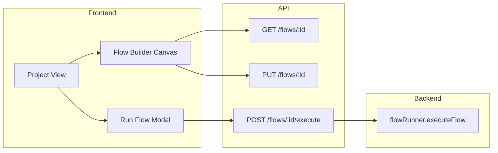

# n8n-Style Flow Builder – Implementation Plan

**Purpose:** Add an n8n-style visual flow builder (canvas with nodes and edges), a "wait" task type with duration, per-block base URL override for UI tasks, and sequential flow execution so tests run block-by-block. The existing list-based flow editor can remain available as an alternative.

**Use this plan** when implementing the flow builder feature at a later stage.

---

## Current state

- **Flows**: [models/Flow.js](../models/Flow.js), [models/FlowTask.js](../models/FlowTask.js). Tasks have `task_type` (`api` | `ui` | `fuzz`), `task_ref` (JSONB), `position`. Order is by `position`.
- **Edit UI**: [public/js/projectManager.js](../public/js/projectManager.js) – modal with ordered list, "Add task" (API/UI from dropdowns), Up/Down/Remove. No canvas, no wait block, no per-block overrides.
- **Execution**: [services/flowRunner.js](../services/flowRunner.js) – iterates tasks by position but does **not** await each run; all tasks start in parallel. Single flow-level `baseUrl` for UI steps.
- **DB**: [migrations/006_flows.sql](../migrations/006_flows.sql) – `task_type` CHECK is `('api', 'ui')` only (fuzz exists in code but may require constraint change if used).

## Architecture (high level)

---

## 1. Backend: Wait task and sequential execution

**1.1 Migration – allow `wait` (and align `fuzz`) in `flow_tasks`**

- Add migration (e.g. `013_flow_task_wait.sql`):
  - Drop existing `task_type` CHECK on `flow_tasks`.
  - Add new CHECK: `task_type IN ('api', 'ui', 'fuzz', 'wait')`.
- No new tables; `task_ref` already JSONB.

**1.2 Flow runner – wait task and per-UI baseUrl**

- [services/flowRunner.js](../services/flowRunner.js):
  - **Sequential execution**: Await each task's execution before starting the next. Today `executeTests` / `runPlaywrightTests` / `executeFuzz` are not awaited; change the loop to `await` them (so one API run, then next task, etc.). This makes "run from block to block" and wait blocks meaningful.
  - **Wait task**: When `task_type === 'wait'`, read `task_ref.durationSeconds` (default e.g. 1), then `await new Promise(r => setTimeout(r, durationSeconds * 1000))`. No test run record for wait.
  - **UI task baseUrl override**: For `task_type === 'ui'`, use `task_ref.baseUrl` when present, otherwise fall back to flow-level `options.baseUrl` (then config). Pass the chosen baseUrl into `runPlaywrightTests({ baseUrl: ... })` and into `PlaywrightRun.create({ base_url: ... })`.

**1.3 API**

- No new endpoints. `PUT /flows/:id` already accepts `flowTasks` with arbitrary `task_ref`. Ensure validation (if any) allows `task_type: 'wait'` and `task_ref: { durationSeconds }` and UI `task_ref.baseUrl`.

---

## 2. Frontend: n8n-style flow builder

**2.1 Entry point and data**

- From project view, add an "Open in Flow Builder" (or "Edit in canvas") action next to "Edit" for each flow. Alternatively, replace "Edit" with opening the flow builder for that flow.
- Flow builder loads: `GET /flows/:id`, `GET /projects/:projectId/collections`, `GET /projects/:projectId/recorded-tests` (reuse same APIs as current edit modal).
- Flow builder saves: build `flowTasks` from canvas node order and `task_ref` per node, then `PUT /flows/:id` with `{ name, description, flowTasks }` (same payload as today).

**2.2 Canvas implementation (vanilla JS, no new framework)**

- **Tech choice**: Keep stack vanilla JS + existing CSS ([public/css/styles.css](../public/css/styles.css)). Implement canvas as a dedicated view: a scrollable/panable container with nodes as DOM elements and edges as SVG lines (single SVG overlay for all edges). No new npm deps required.
- **Files**:
  - New: `public/flow-builder.html` (optional – only if you want a separate page) **or** a new section/view inside the SPA (e.g. new view `flow-builder` in [public/index.html](../public/index.html) and [public/js/app.js](../public/js/app.js)), plus `public/js/flowBuilder.js` and styles in `public/css/styles.css` (or `public/css/flow-builder.css`).
- **Nodes**:
  - One node per flow task. Types: **API**, **UI**, **Wait**.
  - Each node: card with icon + short label (e.g. "API: Get user", "UI: Login", "Wait: 5s"). Click to select; selected node shows a side panel (or inline form) for editing.
- **Edges**:
  - Draw connections from node i to node i+1 (linear chain). Use SVG `<line>` or `<path>` in an overlay; compute positions from node getBoundingClientRect or stored x,y if you add drag later.
- **Order**: Node order on canvas = `position` (0, 1, 2, …). Reorder by drag-and-drop (reorder nodes in DOM and re-serialize) or "Move up / Move down" buttons in the edit panel to avoid complex drag logic in v1.

**2.3 Add / delete / reorder blocks**

- **Add block**: Toolbar or palette with "Add API test", "Add UI test", "Add Wait". "Add API/UI" opens a picker (dropdown or modal) to choose collection+path or recorded test; "Add Wait" asks for seconds. New task appended (or inserted after selected node). New node appears on canvas; `flowTasks` updated in memory and on Save.
- **Delete block**: Delete button on node or in edit panel; remove from nodes array and redraw.
- **Reorder**: Move up / Move down in edit panel, or drag node to new index; update order and redraw edges.

**2.4 Per-block edit panel (inputs)**

- **API block**: Show selected API test name; optional later: env or path overrides. For v1, label/ref only is enough.
- **UI block**:
  - **Recorded test**: Dropdown (or selector) to choose recorded test → `task_ref.recordedTestId` (+ label).
  - **Base URL override**: Optional text input "Webpage URL (override)" → `task_ref.baseUrl`. Empty = use flow run default.
- **Wait block**: Number input "Wait (seconds)" → `task_ref.durationSeconds`. Validate > 0.

All of these read/write the in-memory `flowTasks`; Save sends them to `PUT /flows/:id`.

**2.5 Run from flow builder**

- "Run flow" button in flow builder: open the same run-flow modal as today (run name, base URL for the flow), then call `POST /flows/:id/execute`. No change to execute API; runner now runs sequentially and respects wait and per-UI baseUrl.

**2.6 Navigation and integration**

- Flow builder view: breadcrumb or header "Project X / Flow Y" with "Save", "Run flow", "Back to project".
- After Save, optionally stay in flow builder or go back to project; "Back to project" without save: confirm if dirty.

---

## 3. task_ref contract (summary)

| task_type | task_ref contents |
|-----------|-------------------|
| api | `{ collectionId, path, label? }` (unchanged) |
| ui | `{ recordedTestId, label?, baseUrl? }` – add `baseUrl` |
| fuzz | existing `{ apiSpecId, serverUrl? }` |
| wait | `{ durationSeconds }` (number, > 0) |

---

## 4. Execution order and wait semantics

- **Sequential**: In `executeFlow`, for each task in position order: if API/UI/fuzz, create run and **await** the execute call; if wait, **await** setTimeout. Then proceed to next task.
- **Wait**: Does not create a test run; only delays. Optional: log "Flow X – Wait Ns" for traceability.

---

## 5. Testing and edge cases

- **Empty flow**: Builder should allow saving 0 tasks; runner already throws if no tasks.
- **Invalid refs**: Runner already skips invalid API/UI (missing ids); add same for wait (missing or invalid `durationSeconds`).
- **Backward compatibility**: Existing flows without `baseUrl` or wait continue to work; old edit modal can remain for users who prefer list view, or be replaced by "Edit" opening the flow builder.

---

## 6. Suggested implementation order

1. **Migration** – extend `task_type` CHECK.
2. **flowRunner** – sequential execution, wait task, UI `task_ref.baseUrl`; keep fuzz as-is.
3. **Flow builder UI** – new view + canvas (nodes + edges), load/save flow, add/delete/reorder nodes, edit panel for API/UI/Wait with per-block inputs (including baseUrl and durationSeconds).
4. **Wire "Edit" / "Open in Flow Builder"** from project view and "Run flow" from builder.
5. **Optional**: Remove or hide old list-based edit modal once builder is stable; or keep both and let user choose "Edit (list)" vs "Edit (canvas)".

---

## 7. Out of scope (later)

- **Selector / "text to search" overrides** for Playwright (e.g. replace button text in spec): requires spec templating or variable injection; can be a follow-up.
- **Branches/conditionals** (multiple next steps): would require `next_task_id` or similar; not in this plan.
- **Fuzz in flow builder**: Add "Fuzz" node type and edit panel (apiSpecId, serverUrl) if you want parity with list editor; same pattern as API/UI nodes.
